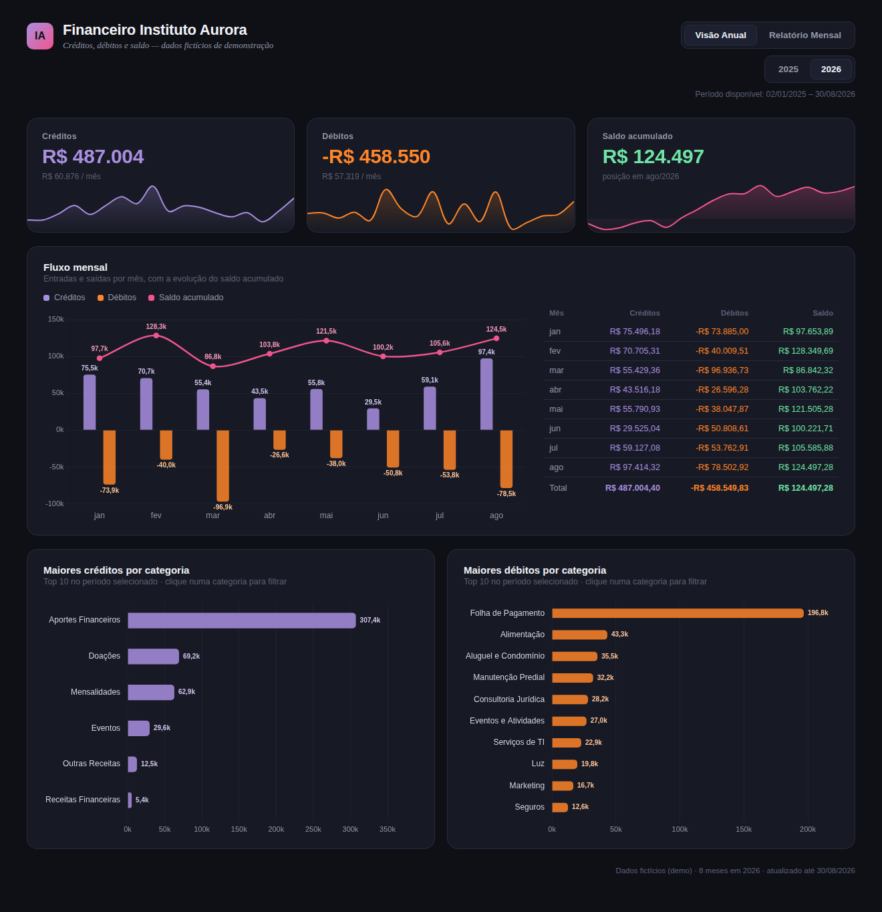
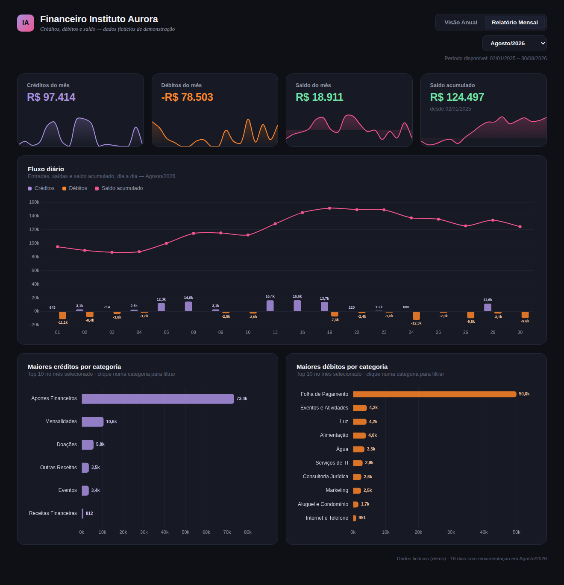

🇧🇷 Português | [🇺🇸 English](README.en.md)

# 📊 Financeiro Dashboard — Fluxo de caixa em tempo real, com automação de ponta a ponta

Um dashboard financeiro interativo, construído como **um único arquivo HTML autossuficiente** (sem build, sem dependências externas em runtime), alimentado por um pipeline de automação que lê dados direto de um ERP financeiro, consolida, e publica sozinho — sem intervenção manual.

**[🔗 Ver demonstração ao vivo](https://andrescultori.github.io/dashboard-financeiro/)**
Senha de demonstração: `demo2026`

> ⚠️ **Todos os dados neste repositório são fictícios**, gerados aleatoriamente para fins de demonstração. Este projeto é uma adaptação, com dados substituídos, de um sistema real em produção para uma instituição educacional sem fins lucrativos.



---

## O problema original

A organização fechava o mês financeiro manualmente: exportava relatórios do sistema de contabilidade, consolidava em planilhas por Power Query, e montava um dashboard no Power BI — um processo que levava horas e dependia de alguém lembrar de fazer isso toda semana.

## A solução

Um pipeline que roda sozinho, uma vez por semana:

```
ERP financeiro (via API)
        ↓
Excel consolidado (SharePoint)
        ↓
n8n (self-hosted, Docker) — lê, consolida e agrega os dados
        ↓
Dashboard HTML (gerado dinamicamente, com os dados embutidos)
        ↓
Publicado automaticamente (deploy via API)
```

Ninguém precisa abrir uma planilha, rodar um script, ou clicar em "atualizar". O dashboard que a Diretoria acessa segunda-feira de manhã já reflete a semana anterior.

## O dashboard em si

- **Visão anual**: KPIs de créditos, débitos e saldo acumulado, com gráfico de área de fundo mostrando a tendência recente
- **Gráfico misto mês a mês**: colunas de entrada/saída + linha de saldo acumulado, com valores exibidos diretamente no gráfico
- **Tabela mensal** ao lado do gráfico, com destaque visual para saldo positivo/negativo
- **Top 10 categorias** de crédito e débito, **clicáveis** — clicar numa categoria filtra todo o dashboard por ela (KPIs, gráfico e tabela recalculam na hora)
- **Relatório mensal** dedicado: fluxo diário, KPIs do mês selecionado, e saldo acumulado histórico
- **Autenticação** — na versão de produção, login corporativo real (Microsoft Entra ID / MSAL.js), restrito por e-mail; nesta demo, uma senha simples ilustra a técnica sem exigir conta Microsoft real



## Stack técnica

| Camada | Tecnologia |
|---|---|
| Frontend | HTML + JavaScript puro (sem framework), Chart.js |
| Autenticação (produção) | Microsoft Entra ID via MSAL.js, com restrição por e-mail no próprio Entra ID |
| Automação | [n8n](https://n8n.io) (self-hosted, Docker) |
| Fonte dos dados | API do ERP financeiro → Excel (Microsoft Graph API) |
| Publicação | Deploy automático via API (Netlify) |
| Design | Sistema de cores/tipografia customizado (tema escuro, Space Grotesk + Inter) |

**Uma decisão técnica deliberada:** o dashboard é um único arquivo `.html`, sem build step, sem `node_modules`, sem framework de frontend. As bibliotecas (Chart.js, e MSAL.js na versão de produção) ficam **embutidas diretamente no arquivo** como texto, ao invés de carregadas via CDN — isso faz o arquivo funcionar sozinho, mesmo offline, e evita qualquer dependência de rede em tempo de execução.

## O pipeline de automação (`/automation`)

- [`n8n-workflow.json`](automation/n8n-workflow.json) — o workflow completo de publicação: autentica via OAuth2 client credentials, lista arquivos numa pasta do SharePoint, escolhe o mais recente por mês, extrai as linhas do Excel, consolida em JSON, injeta num molde HTML, e publica via API
- [`docker-compose.example.yml`](automation/docker-compose.example.yml) — configuração de exemplo para rodar o n8n self-hosted

A lógica de consolidação (agrupar por mês/dia/categoria, calcular saldo acumulado) está embutida no workflow como um node de código — sem dependências externas, só JavaScript puro.

## Rodando localmente

Não precisa de nada além de um navegador:

```bash
git clone <este-repositório>
cd <pasta>
open index.html   # ou clique duas vezes no arquivo
```

Senha: `demo2026`

---

*Projeto adaptado de um sistema em produção. Dados, nomes e identificadores foram substituídos por valores fictícios para esta demonstração pública.*

Desenvolvido por [André Scultori](https://github.com/andrescultori)  ·  © 2026  ·  [GitHub](https://github.com/andrescultori/dashboard-financeiro)
